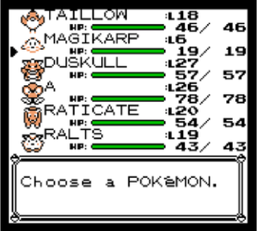
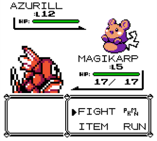
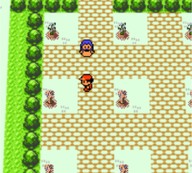
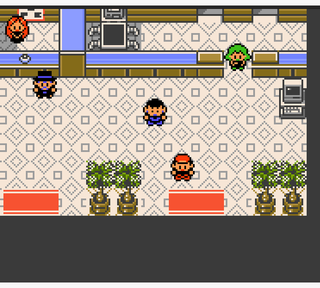
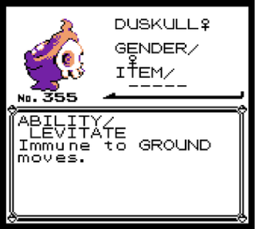
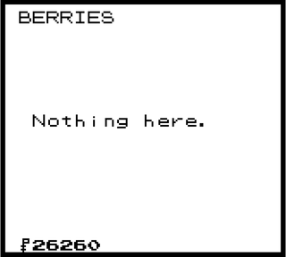
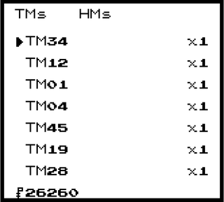

# Kanto Reforged

Gen 2 and 3 content for Red/Blue and Gold on this engine. Same classic story, more Pokemon, moves, abilities, held items, and some bag/party QoL so the extra stuff is easier to use. My goal here was not to bolt on or make things feel weird, but if Game Freak were to do these pieces back in gen1 and gen2, how would they have done it? The features added are attempted to be done in a way to make them feel like they are part of the base games, inspired by some of my favorite things from different generations and rom hacks ive played. I tried my best in the import pipeline to make the gen2-3 mons look good and look like they belong by scaling them, adjusting pixel counts, and following the color count rules and style constraints where i could. Hopefully at the end of the day it looks like an almost "alternate history" version of the classic games.

Mod id is `Kanto-Reforged`. Turn it on in the launcher Mods tab or the F10 manager.

Has support for Gen1 Modern UI mod (on Gen1) and Pokegear Cards (on Gen2).

## Current status

**RBY (generation 1 of gen1recomp++):**
Fully functional with the occasional bug still being chased down, but fully playable and all 386 are obtainable.

**Gold (generation 2 of gen1recomp++):**
Gen 2 Gold support is live. Core pieces:
- Full Hoenn integration (species dex 252 through 386 registered, sprites scaled, Gen 3 abilities patched onto 1–251).
- Type chart and move typing parity across both generations (Dark, Steel, Fairy matchups; Gen 3 physical/special by type).
- Gen 3 freeze parity (1/5 thaw per turn; fire moves melt frozen targets).
- DexNav via Pokegear card (requires `pokegear_cards`) with live route spawns.
- Party Summary page 4: ability, held item, gender glyph, and ability text.
- Berry Farm in Johto and Kanto Centers (stairs / south mats) with Soil Expert badge unlocks, Berry Scholar, and farm merchant.
- Cherrygrove Rare Candy kid + soft level caps through Johto, Lance, the retuned Kanto circuit, and Red at Mt. Silver.
- **Restored Gen 1 Kanto dungeons** back into Gold (layouts, trainers, items, warps): Viridian Forest, Mt. Moon, Diglett's Cave, Rock Tunnel, Safari Zone (4 zones + Secret House), Seafoam Islands (with a dedicated Blaine gym room), and Cerulean Cave. Wilds/trainers scaled for postgame; Articuno (Seafoam B4F) and Mewtwo (Cerulean Cave B1F) return; Mt. Moon hosts the Silver rematch.
- Kanto outdoor wilds rebuilt with Gen 3 postgame grass tables (~Lv 28–40+ on routes; restored caves higher, roughly mid-40s into the 60s). Johto grass keeps curated Gen 3 guests.
- **Retuned Kanto postgame level curve:** gym leaders ~52–72 (Surge → Blue), gym trainees / Fighting Dojo / Nugget Bridge / route trainers matched to that band, dungeon parties in the mid-40s–60s. Soft level caps track it (58 → 64 → 72 → 85 → 100).
- Moon Stone trade-evo bypasses (Steelix, Scizor, Politoed, Slowking, Porygon2, etc.).
- Utility NPCs relocated for Gold Kanto: Move Hub at Mr. Psychic's (Saffron), Item Smith at Cinnabar Center 1F, Judge in the Underground Path.

**Sevii Islands:** On hold. Maps, ferry, and tooling live under `sevii/` but are not loaded (`SEVII_ENABLED = false`). Reserved map ids stay reserved; no Sevii play path until that work resumes.

If you are trying to play, ignore the build instructions below and go to the releases to grab the latest zip. It has custom sprites available in the release that are not in the raw repo. You do not need to generate everything yourself, just install the zip into your game.

## What it looks like







## Features

- Johto and Hoenn species (dex 152 through 386), with sprites, learnsets, and Gen 3 abilities. The original 151 get Gen 3 abilities too, plus some Gen 2/3 moves on learnsets and TMs.
- Dark, Steel, and Fairy types, and a big Gen 2/3 move list (Rollout, weather, hazards, status berries, that kind of thing). Damaging moves use Gen 3 type categories (not Gen 4 per-move split).
- Curated Gen 2/3 mixes in wilds, gyms, Elite Four, and the rival. Optional **FULL SPAWN MIX** / **PURE RANDOM SPAWN** reshuffle from the Gen 1–3 pool (Gold density pass keeps Kanto full; **LEGENDS IN MIX** can open the legendary pool).
- **Gold Kanto restored dungeons:** Gen 1 layouts for Viridian Forest, Mt. Moon, Diglett's Cave, Rock Tunnel, Safari Zone, Seafoam (+ Blaine gym), and Cerulean Cave, with postgame-scaled encounters, trainers, Articuno / Mewtwo, and the Mt. Moon Silver fight.
- **Gold Kanto level curve:** gyms, routes, Dojo, Nugget Bridge, and restored dungeon parties retuned as one postgame band (leaders ~52–72; Blue / Silver / Red sit at the top). Opt-in level caps follow the same milestones (Kanto: 58 / 64 / 72 / 85 / 100).
- Moon Stone evolutions to bypass trade-evolution requirements (Onix→Steelix, Scyther→Scizor, Poliwhirl→Politoed, Slowpoke→Slowking, Porygon→Porygon2, Gloom→Bellossom, Eevee→Umbreon, Sunkern→Sunflora, etc.).
- Held items: berries, Leftovers, Focus Band, type boosters, plus Choice Band / Life Orb / Focus Sash from house NPCs and the blacksmith. Give/Take from the party menu (optional **BAG GIVE** from the bag). Berries work from the bag. Leftovers and Focus Band are overworld finds. Status berries are not sold in city marts — plant at the farm, buy unlocked ones from the farm merchant, or TAKE them off wilds.
- Berry Farm map (right carpet in Gen 1 Centers; stairs / south pads in Gen 2 Centers). Plant, walk, harvest. Soil Expert unlocks by badge (gifts 3 of each new type once). Farm merchant sells unlocked berries. Berry Scholar explains effects.



- Optional smarter trainer AI, **XP SHARE (SLOT 2)** (~70% to fighters, up to ~30% to party slot 2), and story level caps.
- Opt-in level caps: Rare Candy kid outside Viridian Mart (Gen 1) or in Cherrygrove (Gen 2). Accepting tops you toward 99 Rare Candies and enables soft caps that rise with story / badges.
- DexNav: start menu on Red after the Pokédex; Pokegear card on Gold via `pokegear_cards`.
- Party summary page for ability, held item, and gender glyph (Page 3 on Gen 1, Page 4 on Gen 2 with ability text).
- Optional Gen1 Modern UI support for bag pockets and the summary ability page on Red.
[https://github.com/ArmstrongThomas/gen1-modern-ui/](https://github.com/ArmstrongThomas/gen1-modern-ui/)



- Gender on every mon from Gen 2 DV rules.
- Bag pockets on Gen 1: Items, Balls, Key Items, TMs & HMs, Berries. Capacity 60. (Conflicts with `modern_bag`.)




- Optional **EXP BAR** on Gen 1: blue EXP bar under the HP bar (Gen 2 style, widescreen-aware; toggleable).
- Route 5 Day Care: two parents, Eggs, hatching (Gen 1).
- House NPCs: Move Hub (relearn/tutor/delete), Item Smith (Life Orb / Focus Sash / berry packs), DV/Hidden Power Judge.
- Roaming beasts / Eon duo with Radar + Pokédex AREA, plus Gen 2–3 legendary statics in Gen 1.

## Overworld NPCs

Short classic style house NPCs. No natures/IVs; the judge reads DVs / Hidden Power / `statExp`.

- **Celadon Circuit** (Mansion 2F): rematchable club; first clear gives Choice Band.
- **Night Eyes** (Vermilion Pidgey House): Dark-type gate; Blackglasses or money.
- **Snack Scout** (Celadon Hotel): lead must hold a berry; first clear Focus Sash.
- **Judge** (UG Path): DV / Hidden Power / effort read for a party mon (Route 5 side on Gen 1; main tunnel on Gen 2).
- **Trades**: Route 2 house Rattata→Taillow (Cleanse Tag); Fuchsia Bills Grandpa Bellsprout→Seedot (Soothe Bell).
- **Berry economy**: status berries are not sold in city marts. Unlock plant types via badges (Soil Expert). Each unlock gifts 3 of that berry once. Buy more anytime from the farm merchant (¥300 / ¥600 / ¥2000 Lum). Base grow is 320 steps (Soil ranks speed it up). Celadon Mansion 3F blender: 10 berries → 1 vitamin, plus a step cool-down.
- **Move Hub** (Saffron Pidgey House on Gen 1 / Mr. Psychic's House on Gen 2): relearn / tutor / delete; Heart Scale costs where noted.
- **Blacksmith** (Cinnabar Metronome Room on Gen 1 / Cinnabar Pokecenter 1F on Gen 2): Metal Coat→Life Orb, Nuggets→Focus Sash, Leaf Stone→berry pack.
- **Gen 3 fossils** (Gen 1): Root/Claw fossils + Cinnabar lab revive.

Competitive held items (Choice Band, Life Orb, Focus Sash) work in battle: band locks and boosts physical damage, Life Orb recoil, sash survives one lethal hit from full HP.

## Options

Configured in the mod manager / F10 options. Host-scoped keys (spawn/scope) keep Red and Gold settings independent.

- **DEX SCOPE / JOHTO SCOPE** (default NATIONAL / FULL): Gen 1 **KANTO** locks to the original 151 (out-of-scope party/PC mons stash and restore when you switch back). Gen 2 **JOHTO 251** caps Johto wilds at dex 251; Kanto postgame (including restored dungeons) still gets Gen 3 guests.
- **FULL SPAWN MIX** (default off): rebuild wild tables from the Gen 1–3 pool (habitat / level gated). Gold reshuffles Johto + Kanto with a density pass so Kanto stays full. Applies live mid-session.
- **PURE RANDOM SPAWN** (default off): chaos pick from the allowed dex — no habitat / stage / BST gates. Overrides FULL SPAWN MIX when both are on.
- **LEGENDS IN MIX** (default off): with FULL SPAWN MIX or PURE RANDOM SPAWN on, legendaries/mythicals can appear (level-gated). Curated mode ignores this (including a leftover on if you turn FULL/PURE off).
- **XP SHARE (SLOT 2)** (default on): fighters get ~70% of the XP pool; party slot 2 up to ~30% (never more than a solo share total).
- **SMARTER AI** (default on): prefer useful damage, skip moves that would fail.
- **SWITCH HIT AI** (default classic): free-hit timing on switch — **CLASSIC** after send-out vs **GEN 3** lock-on-switch. Same labels on Red and Gold.
- **BAG GIVE** (default on): Give held items from the bag as well as from the party menu.
- **RULESET** (Red only, default MODERN): mirrors OPTIONS → RULESET. **MODERN** cleans Gen 1 quirks and uses Gen 3 crit stages; **GEN 1** keeps faithful quirks. Seeded once when KR is first enabled; either UI stays in sync. Hidden on Gold.
- **SP.ATK / SP.DEF** (Red only, default on): separate Sp.Atk / Sp.Def bases for special damage and summary UI; off keeps Gen 1 single Special. Hidden on Gold (already split).
- **EXP BAR** (Red only, default on): blue EXP bar under the HP bar in battle (widescreen-aware). Hidden on Gold (native bar).
- **DEXNAV** (Red only): start-menu label / off. Gold DexNav is the Pokegear card (no rename toggle).

## Generating the data files

Sprites, `pokemon_data.lua`, ability/learnset/gender/breeding patches, and berry farm art come from `tools/generate_pokemon_mod.py`. It hits PokeAPI (and a couple public sprite sources). Run it from inside the mod folder if you're building from source.

You need Python 3, `requests`, and `Pillow`, plus network on the first run.

```bash
python3 -m pip install requests Pillow
```

### Linux and macOS

```bash
cd mods/Kanto-Reforged   # or wherever the mod lives
python3 tools/generate_pokemon_mod.py
```

### Windows

Install Python 3 from python.org and tick "Add Python to PATH". Then in Command Prompt or PowerShell:

```bat
cd path\to\Kanto-Reforged
py -m pip install requests Pillow
py tools\generate_pokemon_mod.py
```

## Installing in the game

1. Grab the latest `.zip` from releases.
2. Put `Kanto-Reforged/` under the game's `mods/` folder, or install the zip from the launcher.
3. Enable Kanto Reforged (and `pokegear_cards` if playing Gold) and start or continue a save.

## Full guides

- **[WALKTHROUGH.md](WALKTHROUGH.md)**: step-by-step walkthrough for both Gen 1 (Red/Blue) and Gen 2 (Gold), written like youre playing through
- **[FEATURES.md](FEATURES.md)**: full reference (numbers, locations, unlock gates, prices, recipes, module map)

## Credits

PokeAPI for species/moves/habitat data. pret/pokered and pret/pokecrystal and this recomp project for the base game foundations. recomp project for the Gen 1 base.
