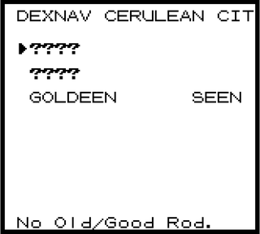
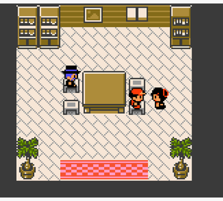

# Kanto Reforged

Gen 2 and 3 content for Red/Blue on this engine. Same Kanto story, more Pokemon, moves, abilities, held items, and some bag/party QoL so the extra stuff is easier to use. My goal here was not bolt on or make things feel weird, but if gamefreak were to do these pieces in gen1 how would they have done it? the features added are attempted to be done in a way to make them feel like they are part of gen 1 inspired by some of my favorite thing from different generations and rom hacks ive played. I tried my best in the import pipeline to make the gen2-3 look good and look like they blong in gen1 by scaling them, adjusting the pixel counts and following the color count rules and style constraints where i could. hopefully at the end of the day it looks like an almost "alternate history" version of gen1.

Mod id is `Kanto-Reforged`. Turn it on in the launcher Mods tab or the F10 manager.

Has support for Gen1 Modern UI mod.

## Current status

**RBY (generation 1 of gen1recomp++):**
fully functional with the occasional bug still being chased down but fully playable and all 386 are obtainable

**Gold (gen1recomp++):** In progress. Basic Gold support is wired in - KR content can load on Gold, with type-chart / move-type fixes, Gen2 palette registration for imported species, and related hooks already landing. Still tweaking, adjusting, and filling gaps so the full Kanto-Reforged feature set reaches Gen1 (Red) parity on Gold.
still need to add abilities info to party pokemon pages and finish adding in all the kanto additions into kanto in kanto XD
farm is sitll being implemented and extended in gen2

**Sevii Islands:** On hold. Maps, ferry, and tooling live under `sevii/` but are not loaded (`SEVII_ENABLED = false`). Reserved map ids stay reserved; no Sevii play path until that work resumes.

## What it looks like


## Features

- Johto and Hoenn species (dex 152 through 386), with sprites, learnsets, and Gen 3 abilities. The original 151 get Gen 3 abilities too, plus some Gen 2/3 moves on learnsets and TMs.
- Dark, Steel, and Fairy types, and a big Gen 2/3 move list (Rollout, weather, hazards, status berries, that kind of thing).
- Curated Gen 2/3 mixes in wilds, gyms, Elite Four, and the rival. Optional FULL SPAWN MIX rolls encounters from the whole Gen 1 through 3 pool.
- Held items: berries, Leftovers, Focus Band, type boosters, plus Choice Band / Life Orb / Focus Sash from house NPCs and the blacksmith. Give/Take from the party menu. Berries can be used from the bag. Leftovers and Focus Band are overworld finds. Status berries are not sold in city marts. You plant berries at the farm to grow more, buy unlocked ones from the farm merchant, or find them held on wilds.
- Berry Farm map (mat in every Pokémon Center). Plant a berry, walk, harvest more. Badge unlocks open new berry types via the Soil Expert. First unlock of each type gifts you 3 so you can plant without eating your last one. Farm merchant sells whatever youve unlocked. Berry Scholar explains effects.


- Optional smarter trainer AI, slot-2 XP Share (70% pool to fighters, up to 30% to party slot 2, never more than a solo share total), and story level caps (you opt in by taking Rare Candies from an NPC in Viridian).
- There is an NPC in Viridian next to the pokemart, talking to him he will ask you if you want some rare candies, you do not have to take them, you can say no, it wont give them, however as soon as you take any amount of them from him the level cap system will kick in. Its basically just a level cap that expands with the story/gyms as you progress to prevent you from over leveling with rare candies and trivializing the progression
- DexNav on the start menu after you get the Pokedex (shows whats on the current route; more info once youve seen/caught them). Mod setting **DEXNAV**: default label, **DEXNAV-KR** to tell it apart from another DexNav, or **OFF** to hide it.



- Party summary page for ability and held item (and gender glyph on the name).
- Optional Gen1 Modern UI support for bag pockets and the summary ability page (DexNav / party Give-Take keep working via existing menu hooks). Without that mod, everything still uses the normal Gen 1 screens.
[https://github.com/ArmstrongThomas/gen1-modern-ui/](https://github.com/ArmstrongThomas/gen1-modern-ui/)


- Gender on every mon (see **Gender** below).
- Bag pockets: Items, Balls, Key Items, TMs & HMs, Berries. Bag capacity bumped to 60.


- New moves borrow Gen 1 battle anims. New species borrow Gen 1 menu icon classes so the lists arent empty boxes.
- Route 5 Day Care supports two parents, Eggs, and hatching (see **Day Care and breeding** below).



- House NPCs for competitive play and utility (see **Overworld NPCs** below).
- Roaming beasts / Eon duo with Radar + Pokédex AREA, plus Gen 2–3 legendary statics (see **Legendary hunting** below).

## Overworld NPCs

Short gen1 style house NPCs. No natures/IVs. The judge reads DVs / Hidden Power / `statExp`.

- **Celadon Circuit** (Mansion 2F): rematchable club; first clear gives Choice Band.
- **Night Eyes** (Vermilion Pidgey House): Dark-type gate; Blackglasses or money.
- **Snack Scout** (Celadon Hotel): lead must hold a berry; first clear Focus Sash.
- **Judge** (UG Path Route 5): DV / Hidden Power / effort read for a party mon.
- **Trades**: Route 2 house Rattata→Taillow (Cleanse Tag); Fuchsia Bills Grandpa Bellsprout→Seedot (Soothe Bell).
- **Berry economy**: status berries are not sold in city marts. Unlock plant types via badges (Soil Expert). Each unlock gifts 3 of that berry once. Buy more anytime from the farm merchant (¥300 / ¥600 / ¥2000 Lum). Grow is 320 steps (Soil ranks speed it up). Celadon Mansion 3F blender: 10 berries → 1 vitamin, plus a step cool-down.
- **Move Hub** (Saffron Pidgey House): relearn / tutor / delete; Heart Scale costs where noted.
- **Blacksmith** (Cinnabar Metronome Room): Metal Coat→Life Orb and similar exchanges.
- **Gen 3 fossils**: Root/Claw fossils + Cinnabar lab revive.

Competitive held items (Choice Band, Life Orb, Focus Sash) work in battle: band locks and boosts physical damage, Life Orb recoil, sash survives one lethal hit from full HP.

## Legendary hunting

- **Roamers**: after Silph, Beast Tracker (Mansion 2F) gives Roaming Radar and starts Raikou/Entei/Suicune. Latias/Latios after Champion (Indigo lobby). Foot travel migrates to adjacent routes; Fly/Teleport/blackout reshuffles. Cry on map enter when one is here. High level so Repel does not block them. Radar (bag / start menu) shows route + HERE/NEXT DOOR/FAR. DexNav adds a ROAM row only if the beast is on the current map. Pokédex AREA line after first `seen`.
- **Statics**: Ho-Oh (Celadon roof + Rainbow Wing), Lugia (Seafoam + Silver Wing), Kyogre/Groudon (orbs), Regis (scholar + seals; Regirock in a Rock Tunnel ladder chamber), Rayquaza/Celebi/Deoxys on custom maps (indices 1101–1103) with return warps, Jirachi (Mt Moon, Heart Scales).

Legendary overworld sprites reuse Gen 1 sheets (`SPRITE_BIRD` / `SPRITE_MONSTER` / `SPRITE_FAIRY`). Intentional so they fit gen1.

## Gender

Every Pokemon gets a gender from Gen 2 rules: Attack DV vs the species `genderRate` (female eighths from PokéAPI). Always-male / always-female / genderless lines stay that way. Existing saves are backfilled from DVs on load so mid-run parties and the PC stay consistent.

- Summary and nickname lines can show ♂ / ♀.
- Attract and Cute Charm use real opposite-gender infatuation (Cute Charm is Gen 3's 1/3 rate in battle).
- Captivate only hits the opposite gender.
- A Cute Charm lead biases wild genders (~2/3 opposite) like Emerald+.

## Day Care and breeding

The Route 5 Day Care house (same building as vanilla) is Gen 3-style when this mod is on. Inside you get the Day-Care Man and a Day-Care Lady; Route 5 outdoors is unchanged.

**Basics**

- Leave up to two Pokemon with them (you must keep at least one in your party).
- Talk to either NPC to deposit, check on them, pay the usual level-based fee to take one back, or pick up an Egg when one is ready.
- With two compatible parents they will eventually produce an Egg. Take the Egg into your party and walk to hatch it (level 5). Flame Body / Magma Armor in the party speeds hatching like Gen 3.

**Compatibility (they tell you in dialogue)**

- Same species, opposite gender → best odds.
- Shared egg group, opposite gender → lower odds.
- Ditto + anything breedable → works (two Ditto does not).
- Undiscovered (legendaries, babies that cannot breed, etc.) → no Egg.

**Inheritance (Gen 1-shaped, not Gen 3 IVs/natures)**

- Species comes from the mother (or the non-Ditto parent).
- DVs use a Crystal-style mix: Defense and Special tend to come from one parent, the rest can vary.
- Egg moves can come from the father when the baby can learn them.
- No Everstone, no Natures, no IVs. This pack stays on Gen 1 DVs / statExp.

**Line quirks**

- Nidoran♀ / Illumise eggs are a 50/50 species flip (male or female form).
- Incense-only babies (Azurill, Wynaut, etc.) need incense items we do not ship yet, so those lines breed Marill / Wobbuffet instead.
- Gen 4 babies (Happiny, etc.) are clamped to the Gen 1–3 form we actually have.

**Saves**

- Prefer the game's normal Lua save slots. Exporting to a Gen 1 `.sav` and importing it back will drop Johto/Hoenn Pokemon (and Eggs). The old battery format has no room for them.

## Caveats

- Friendship, time, and location evolutions are fudged to fit Gen 1.
- Move anims and party icons are reused Gen 1 stock, not new art, im trying to keep it as close to how it would map to gen1 as possible.
- DexNav includes Super Rod on that map. Old/Good Rod are global pools; fishable maps say so in the footer.
- Flip FULL SPAWN MIX before a long save if you care. It rewrites encounter tables.
- Level caps stay off until you take those Viridian Rare Candies.
- This mod sets `affects_link`. Both sides need matching mods for link play.

## Options

- FULL SPAWN MIX (default off): random Gen 1 through 3 wild tables
- XP SHARE (SLOT 2) (default on): fighters split 70% of the Gen 1 XP pool; party slot 2 gets up to 30% (clamped below actives)
- SMARTER AI (default on): prefer useful damage, skip moves that would fail
- SP.ATK / SP.DEF (default off): use separate Special Attack / Special Defense from PokeAPI for special damage and summary UI; off keeps Gen 1 single Special

## Generating the data files

Sprites, `pokemon_data.lua`, ability/learnset/gender/breeding patches, and berry farm art come from `generate_pokemon_mod.py`. It hits PokeAPI (and a couple public sprite sources). Run it from inside the mod folder after you unzip, or whenever you want a fresh pull.

You need Python 3, `requests`, and `Pillow`, plus network on the first run.

```bash
python3 -m pip install requests Pillow
```

### Linux and macOS

```bash
cd mods/Kanto-Reforged   # or wherever the mod lives
python3 generate_pokemon_mod.py
```

That drops species data, `assets/`, and the related Lua patches in the same folder.

Other flags if you only need one piece:

```bash
python3 generate_pokemon_mod.py --berry-farm-only
python3 generate_pokemon_mod.py --ability-patches-only
python3 generate_pokemon_mod.py --special-stat-patches-only
python3 generate_pokemon_mod.py --gender-patches-only
python3 generate_pokemon_mod.py --breeding-patches-only
python3 generate_pokemon_mod.py --learnset-patches-only
python3 generate_pokemon_mod.py --resprite
```

### Windows

Install Python 3 from python.org and tick "Add Python to PATH". Then in Command Prompt or PowerShell:

```bat
cd path\to\Kanto-Reforged
py -m pip install requests Pillow
py generate_pokemon_mod.py
```

If `python` works on your machine, use that instead of `py`.

### Android

Dont try to run the generator inside the game. Do it on a PC, or in Termux with Python installed, then zip the finished folder and install that zip from the Android mod picker.

Termux rough steps:

```bash
pkg install python
pip install requests Pillow
cd ~/storage/.../Kanto-Reforged
python generate_pokemon_mod.py
```

Zip it up afterward and import in-game.

## Installing in the game

1. Run the generator if `assets/` or `pokemon_data.lua` are missing.
2. Put `Kanto-Reforged/` under the games `mods/` folder, or install the zip from the launcher.
3. Enable Kanto Reforged and start or continue a save.

## Full guide

- **[WALKTHROUGH.md](WALKTHROUGH.md)**: when to visit new NPCs, the farm, legendaries, written like youre playing through
- **[FEATURES.md](FEATURES.md)**: full reference (locations, unlock gates, prices, recipes, module map)

## Credits

PokeAPI for species/moves/habitat data. pret/pokered and this recomp project for the Gen 1 base.
